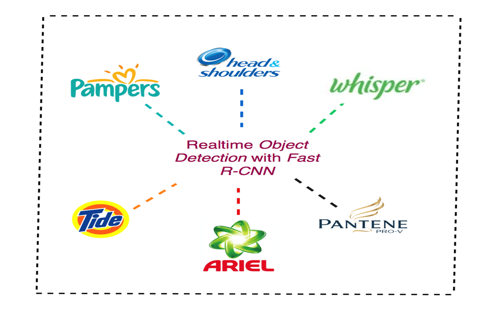
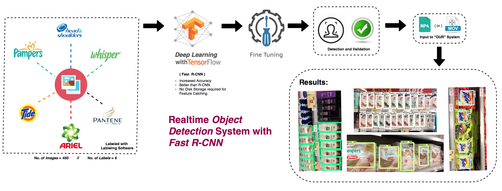

# Object Detection Using Tensorflow

# Problem Statement

  

# Architecture and Output

  

# Demo 

https://youtu.be/l8GDmGLfAfM 

# Installation

TensorFlow™ is an open source software library for numerical computation using data flow graphs. Nodes in the graph represent mathematical operations, while the graph edges represent the multidimensional data arrays (tensors) communicated between them.

## Installation

**1.) Python and pip**

Python is automatically installed on Ubuntu. Take a moment to confirm (by issuing a python -V command) that one of the following Python versions is already installed on your system:

- Python 2.7
- Python 3.3+

The pip or pip3 package manager is usually installed on Ubuntu. Take a moment to confirm (by issuing a *pip -V* or *pip3 -V* command) that pip or pip3 is installed. We strongly recommend version 8.1 or higher of pip or pip3. If Version 8.1 or later is not installed, issue the following command, which will either install or upgrade to the latest pip version:

    $ sudo apt-get install python-pip python-dev   # for Python 2.7
    $ sudo apt-get install python3-pip python3-dev # for Python 3.n
    
**2.) OpenCV**

See required commands to install OpenCV on Ubuntu in [here](https://gist.github.com/dynamicguy/3d1fce8dae65e765f7c4).

**3.) TensorFlow**

Install TensorFlow by invoking one of the following commands:

    $ pip install tensorflow      # Python 2.7; CPU support (no GPU support)
    $ pip3 install tensorflow     # Python 3.n; CPU support (no GPU support)
    $ pip install tensorflow-gpu  # Python 2.7;  GPU support
    $ pip3 install tensorflow-gpu # Python 3.n; GPU support

**4.) TensorFlow Object Detection API**

See required commands to install TensorFlow Object Detection API on Ubuntu in [here](https://github.com/tensorflow/models/blob/master/research/object_detection/g3doc/installation.md).

# Steps To Run this File

The object detection classifier is all ready to go!

Step1: 
Python scripts are available to test it out on an image, video, or webcam feed.
Feed an image or Video.

Step2:
To test your object detector, move a picture of the object or objects into the \object_detection folder, and change the IMAGE_NAME variable in the Object_detection_image.py to match the file name of the picture.

Step3:
To run any of the scripts, type “idle” in the Anaconda Command Prompt (with the “tensorflow1” virtual environment activated) and press ENTER. This will open IDLE, and from there, you can open any of the scripts and run them.

If everything is working properly, the object detector will initialize for about 10 seconds and then display a window showing any objects it’s detected in the image!

*Including the Dataset provided we have also include our images for better accuracy. 
And those images are uploaded with this github repository. 
